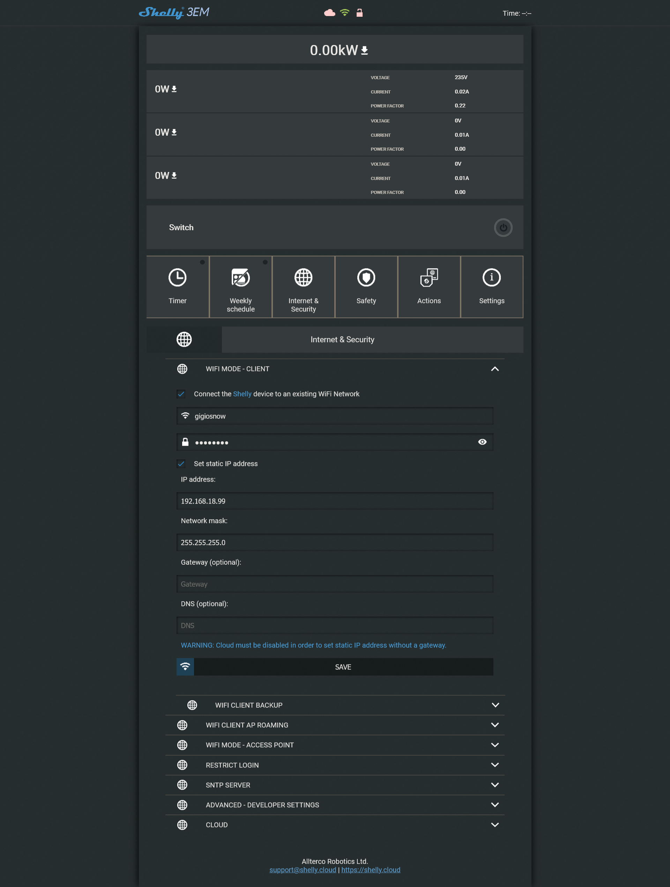

# Shelly 3 EM Control Documentation


<p align="left">
  <a href="https://www.python.org" target="_blank" rel="noreferrer">
    
  </a>
  <a href="https://www.postgresql.org" target="_blank" rel="noreferrer">
    
  </a>
</p>

<a href="https://github.com/GiorgioCitterio/Shelly_3EM_control/blob/master/docs/README.it.md">README.it 🇮🇹</a>

---

This documentation explains how to use a Python program called Shelly 3 EM Control (`ShellyEm_control.py`) that utilizes the cloud APIs of a Shelly 3 EM device to make periodic requests and process measured data. The program stores the data in a PostgreSQL database and includes a graphical interface built with Tkinter, which allows users to search for the Shelly ID and view activated sensors for data measurement.

## Python Program Documentation for Interacting with Shelly 3EM APIs and Using PostgreSQL Database via Python

The following Python code is designed to interact with the cloud APIs of a Shelly 3EM device, make periodic requests to retrieve sensor data, and save that data in a PostgreSQL database. The program also includes a Tkinter-based graphical interface to search for the Shelly ID and view activated sensors for data measurement.

### Dependencies
The program requires the installation of the following Python modules:
- `requests`: Used for making HTTP requests to the Shelly APIs.
- `schedule`: Used for scheduling and executing periodic requests to the APIs.
- `json`: Used for manipulating data in JSON format.
- `psycopg2`: Used for connecting to the PostgreSQL database.
- `config`: Custom module for configuring the database connection parameters.
- `tkinter`: Module for creating the graphical interface.
- `threading`: Used to run the cron job in a separate thread.
- `classes.Em` and `classes.Sensor`: Custom modules defining the `Em` and `Sensor` classes used in the program.

### Configuration
Before running the program, some configurations need to be made:
- Modify the Shelly 3EM API URL within the `url` variable in the code.
- Set the values of the `body_data` variable correctly to authenticate and identify the correct Shelly device.
- Configure the connection parameters for the PostgreSQL database. To do this, create a `database.ini` file in the `Shelly_3em` directory with the following fields:
```
[postgresql]
host=localhost
database=db_name
user=username
password=password
```

### Program Functionality
The program is divided into several functions to handle different phases of interacting with the Shelly APIs and managing data in the database. Here is an overview of the main functions and their purposes:

1. `connect()`: Function to connect to the PostgreSQL database using the configured connection parameters. It creates a `conn` object for the connection and a `cur` object for the database cursor.
2. `disconnect()`: Function to disconnect from the database. It closes the cursor and the database connection.
3. `create_tables()`: Function to create the `measurements` and `sensor` tables in the database if they don't already exist. These tables are used to store sensor data and information about activated sensors for each Shelly ID and phase.
4. `insert_lists()`: Function to insert sensor and measurement data into the database. It uses the `sensor_list` and `measurement_list` lists to retrieve the data to be inserted. It also checks if the sensors already exist in the database before performing the insertion.
5. `send_request()`: Function to send a request to the Shelly APIs to retrieve sensor data. It uses the `requests` library to send a POST request to the URL specified in the `url` variable, along with the authentication and Shelly device identification parameters. The response is then converted to JSON format and parsed to extract sensor data and corresponding measurements.

6. `tkinter_init()`: Function to initialize the graphical interface using the Tkinter library. It creates a main window and adds labels, input fields, and buttons for user interaction.

7. `search()`: Function to search for a Shelly device in the database using the ID specified by the user in the graphical interface. It executes a query to check if the ID exists in the database and displays a dialog window with the search result.

8. `open_sensor_table_window()`: Function to open a separate window displaying the sensor table for a specific Shelly device. It retrieves sensor data from the database and creates checkboxes corresponding to the sensors in the window. It allows the user to modify the state of the checkboxes and apply or cancel the changes.

9. `run_cron_job()`: Function that is cyclically executed every 5 seconds using the `schedule` library. It invokes the `send_request()` function to retrieve sensor data from the Shelly APIs.

10. `main()`: Main function of the program. It handles establishing the database connection, creating tables, initializing the graphical interface, starting the cron job in a separate thread, and managing program exit.

These are the main functions that make up the program and perform various operations such as database management, interaction with the Shelly APIs, and handling the graphical interface. This is an overview, and you can extend or modify the code to fit your specific needs.

---

## Initial Configuration

Before using the program, you need to perform some initial configuration steps for the Shelly 3 EM device.

1. Device Connection: Connect to the Wi-Fi network created by the Shelly 3 EM device, which also acts as an access point.
2. Accessing the Web Interface: Open a browser and navigate to http://192.168.33.1/ to access the web interface of the Shelly 3 EM device. Here, you can view the measured values from the default interface.


## Device Connection Modes

The Shelly 3 EM device offers two connection modes: MQTT and Cloud. Only one mode can be used at a time.

### MQTT Mode

In MQTT mode, the device sends the measured data to specific MQTT topics. The following steps outline the configuration and testing of the MQTT mode:

1. MQTT Configuration on the Device: Using the device's web interface, configure the MQTT settings by specifying the MQTT broker and its parameters such as IP address and port.
2. Installation and Configuration of MQTT Broker: Install an MQTT broker on your system. In this example, Mosquitto broker is used. Configure the broker by specifying the desired settings such as IP address and port.
3. Testing MQTT Connection: Use an MQTT client, such as MQTTX, to test the connection to the MQTT broker and verify if the data is being successfully sent to the specified topics.
4. Data is sent via MQTT to the topics every 30 seconds.

Enabling MQTT from Shelly:


### Cloud Mode

In Cloud mode, the Shelly 3 EM device sends the measured data to a cloud server using the manufacturer's cloud APIs. The following steps explain how to use the Cloud mode:

1. Device Registration on the Cloud Server: Create an account on the manufacturer's cloud server and follow the instructions to register the Shelly 3 EM device. During registration, you will need to create a room and provide device information.
2. Accessing Data and Device Control: After registering the device, you can access device information and control through the web interface or mobile app provided by the manufacturer.


Testing cloud API usage:
```
auth key: your_auth_key
server uri: your_server_uri
device id: your_device_id
uri post test: curl -X POST server_uri -d "id=device id&auth_key=auth key"
```


After testing the request from the command line, I created a Python program to make the request and save the response to a JSON file.

The device can choose to use either MQTT or Cloud. Both functions cannot be used simultaneously.

## Data Timing
By downloading the local CSV file of retained voltages (`vm_data.csv`), you can see that the data is saved every minute.
From MQTT, it could be observed

 that the data was sent every 30 seconds.
Analyzing the JSON returned by Postman, it can be seen that the data is updated every 10 minutes as the `time` parameter varies by 10 minutes. If a request is sent within that 10-minute interval, the same previous data will be returned.
[Database Screenshot](images/Screenshot%202023-06-15%20174510.png)


